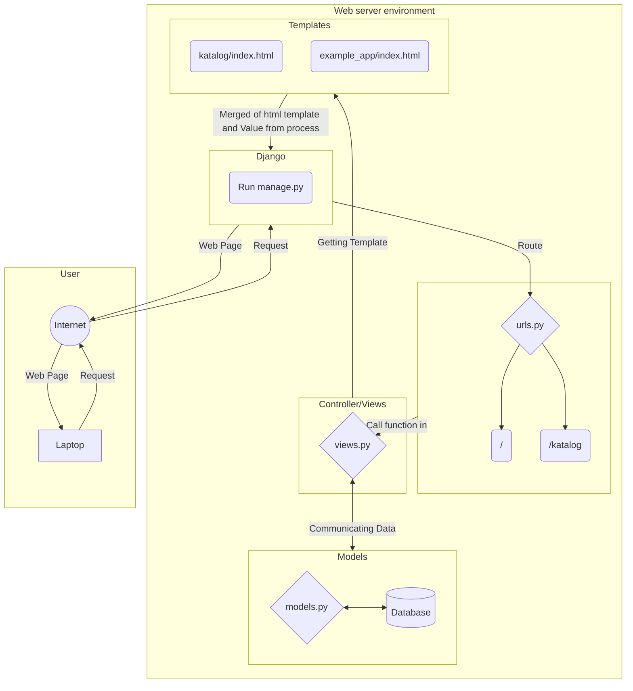

```mermaid
  flowchart TB
    subgraph TOP [Web server environment]
      direction TB
      subgraph Django
        direction TB
        i1(Run manage.py)
      end
      Django -->|Route| R{urls.py}
      subgraph UR [" "]
        direction TB
        R --> r1(/) & r2(/katalog)
      end
      subgraph VI["Controller/Views"]
        V
      end
      subgraph T["Templates"]
        direction TB
        HT1(katalog/index.html)
        HT2(example_app/index.html)
      end
      VI -->|Getting Template| T
      T -->|Merged of html template and Value from process| Django
      UR -->|Call function in| V{views.py}
      V <-->|Communicating Data| MD
      subgraph MD[Models]
        M{models.py} <--> D[(Database)]
      end
    end
    subgraph DOWN [User]
      B((Internet)) -->|Web Page| A[Laptop]
      A -->|Request| B
    end
    B -->|Request| Django
    Django -->|Web Page| B
```
