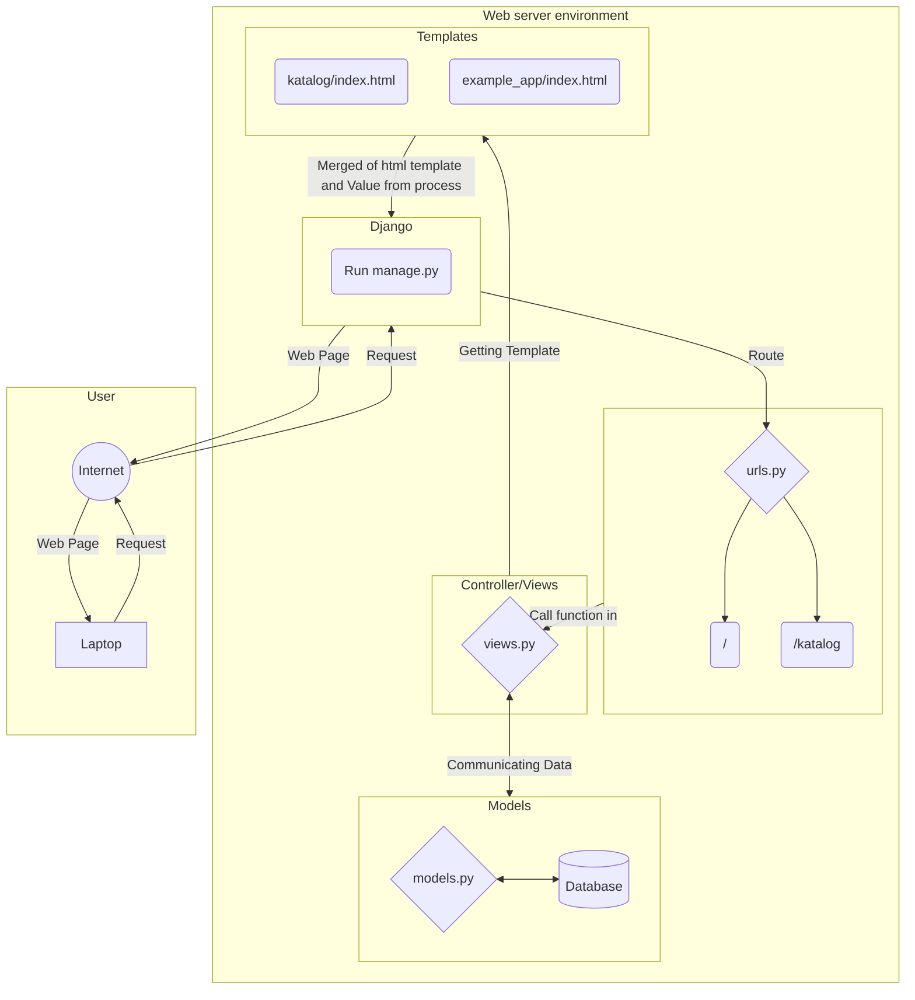

### Link Aplikasi Heroku
https://tugas2-pbp-alek.herokuapp.com
### Bagan Request Client ke Aplikasi Web Berbasis Django

### Penjelasan Bagan:
Seorang *user(client)* membuka *browser*, lalu mengetikkan *URL* sebuah *website*. Pada saat *user* menekan *enter*, maka *browser* akan melakukan *HTTP Request* kepada *server* yang menyimpan semua data *website* tersebut. *Server* akan merespons dengan menjalankan aplikasi Django, melalui *manage.py*. Ketika aplikasi dijalankan, maka hal yang pertama kali dilakukan oleh aplikasi adalah melihat *URL Route* pada *URL* yang diketikkan *user*. Misalnya, *user* mengetikkan "*https://tugas2-pbp-alek.herokuapp.com/katalog*", maka *URL Route* dari *URL* tersebut adalah "*/katalog/*".

Peran *urls.py* disini adalah melakukan *mapping* terhadap *URL Route* yang diminta. Jika *URL Route* yang diminta merupakan salah satu *pattern* di *urls.py*, maka *urls.py* akan memanggil *function* pada *views.py* yang bersesuaian pada *URL Route* tersebut. Tetapi, jika *URL Route* yang diminta tidak ada pada *pattern*, maka *server* akan merespons *HTTP Request* dengan kode *404 (Page Not Found)*

*Function - function* yang akan berperan sebagai ***controller*** tiap *URL Route* disimpan di *views.py*. Secara tidak langsung, *views.py* jugalah yang akan "berkomunikasi" dengan *database*. Tidak hanya itu, *views.py* juga yang akan mendelegasikan pemformatan data pada *templates*, serta memilih *template* yang tepat yang akan menjadi *response page* di browser nanti.

Skema *database* dan struktur *data* disimpan di *models.py*. Oleh karena itu, *models.py* disini berperan sebagai **model** yang juga menyediakan mekanisme untuk mengelola data (*add*, *modify*, *delete*) dan juga *query* ke *database*.

Halaman yang ditampilkan kepada *user* pada *browser* adalah berupa *file html*. Pada akhirnya, *web server* akan merespons *HTTP Request* dengan sebuah *file html*. File - file html pada sebuah aplikasi Django disimpan pada sebuah ***templates***.

### Mengapa Menggunakan *Virtual Environment*?
*Virtual environment* digunakan agar *dependencies* yang terinstal hanya *dependencies* yang dibutuhkan pada aplikasi web kita saja. Misalkan kita membuat aplikasi yang berskala besar dan ada banyak sekali *dependencies*. Mungkin tidak masalah jika aplikasi yang kita buat tersebut hanya dipakai dalam jangka waktu pendek. Tetapi, jika aplikasi tersebut dipakai dalam jangka waktu panjang, maka akan sangat membuang waktu untuk me-*maintance* *bugs* yang mungkin diakibatkan oleh *library - library* yang membutuhkan *update* atau bahkan sudah *deprecated* jika kita tidak menggunakan *virtual environment*.
Namun, kita sebenarnya bisa membuat aplikasi web berbasis Django tanpa menggunakan *virtual environment*

### Cara Pengimplementasian Program
Pertama, saya membuat sebuah fungsi bernama *index* pada "views.py" dengan *request* sebagai parameter. Lalu, saya melakukan *query* ke *database* untuk mengambil semua data yang ada pada tabel **CatalogItem**. Setelah itu, saya membuat suatu variabel dengan tipe data *dictionary* yang menyimpan himpunan *key-value pair* yang nantinya akan diteruskan ke dalam file *html*, sehingga data - data dalam *dictionary* tersebut bisa digunakan pada file *html* tersebut dengan pengaksesan *key*-nya. Setelah itu, return fungsi *render* dengan *request*, file html: "katalog.html", dan variabel dictionary tadi sebagai parameternya.

Kedua, saya membuat sebuah file dengan nama "urls.py" yang berisi sebuah variabel yang akan menyimpan semua pemetaan *URL Route* katalog *app* ke fungsi bersesuaian yang ada di "views.py". Variabel tersebut bernama *urlpatterns* dengan tipe data *list*.

Ketiga, lakukan pemetaan data yang yang diteruskan dari fungsi *index* pada "views.py" ke dalam HTML dengan sintaks dari Django untuk pemetaan data template. Data dapat diakses dengan menulis "*{{ \<key\> }}*" pada file *html*-nya.

Keempat, buat aplikasi baru pada heroku. Lalu, tambahkan "HEROKU_API_KEY" dan "HEROKU_API_NAME" pada *Secrets* di *repository django project* tersebut yang ada pada github. Setelah itu, tinggal lakukan *re-deployment* pada file *dpl.yml*.
